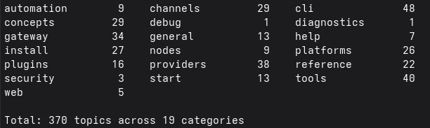
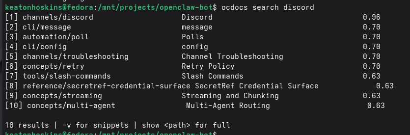

# ocdocs (openclawdocs)

**A CLI built for LLM agents, not humans.** Syncs, indexes, and searches the entire [OpenClaw](https://openclaw.ai) documentation locally so AI agents can look things up instead of hallucinating them.

[](https://www.npmjs.com/package/openclawdocs)
[](https://opensource.org/licenses/MIT)
[](https://ko-fi.com/H2H815OTBU)

---

## Why I Built This

I'm building [CleoClaw](https://github.com/kryptobaseddev/cleoclaw) — a Mission Control frontend for OpenClaw instances. Every time I ask an AI agent to implement something against the OpenClaw API, it confidently makes up endpoint behavior, invents config keys that don't exist, and hallucinates RPC methods. Context7, training data, web search — none of them reliably reflect what's *actually* in the [OpenClaw docs](https://docs.openclaw.ai) right now.

So I built a tool that downloads the entire doc site, indexes it locally with SQLite FTS5, and lets agents query it with minimal token cost. Now when my agent needs to know how Discord integration works, it spends 150 tokens reading the summary instead of 10,000 tokens guessing wrong.

**This is purpose-built for OpenClaw documentation.** It's not a generic doc scraper. It knows about OpenClaw's `llms-full.txt` dump, Mintlify page structure, and the specific categories that matter when you're building on top of OpenClaw.

**Humans can use it too** (the output is perfectly readable, as you'll see below), but every design decision optimizes for agent consumption: structured output, minimal tokens, progressive disclosure.

## What It Looks Like

### Browse all 370 topics across 19 categories

```bash
ocdocs list
```



### Search with FTS5 BM25 ranking + fuzzy matching

```bash
ocdocs search discord
```



### Drill into any topic (summary first, full content on demand)

```bash
ocdocs show channels/discord
```

```
# Discord
Category: channels | 4,797 words | https://docs.openclaw.ai/channels/discord

Status: ready for DMs and guild channels via the official Discord gateway.

## Sections (17)
- Quick setup
- Recommended: Set up a guild workspace
- Runtime model
- Forum channels
- Interactive components
- Access control and routing
- Developer Portal setup
- Native commands and command auth
- Feature details
- Tools and action gates
- Components v2 UI
- Voice channels
- Voice messages
- Troubleshooting
- Configuration reference pointers
- Safety and operations
- Related

> openclaw-docs show channels/discord --full
```

### Pull just the section you need

```bash
ocdocs show channels/discord -s "quick setup"
```

```
# Discord > Quick setup
Category: channels | Section of 4,797 word topic

You will need to create a new application with a bot, add the bot to your
server, and pair it to OpenClaw. We recommend adding your bot to your own
private server...
```

### Diff local docs against the live site

```bash
ocdocs diff
```

```
Checking remote...
No changes detected. Local docs are up to date.
```

### Sync pulls everything down (idempotent)

```bash
ocdocs sync
```

```
Syncing documentation...
Sync complete.
  Added:     0
  Updated:   0
  Removed:   0
  Unchanged: 370
  Total:     370
```

First run downloads 370 topics. Subsequent runs use ETag caching and content hashing — only fetches what changed.

---

## Install

### npm (recommended)

```bash
npm install -g openclawdocs
ocdocs sync
```

Requires Python 3.12+. The postinstall script creates a Python venv and installs everything automatically.

If your system `python3` points to an older version, set one of these before install:

```bash
OPENCLAWDOCS_PYTHON=$(command -v python3.12) npm install -g openclawdocs
# or
PYTHON=$(command -v python3.12) npm install -g openclawdocs
```

Three aliases work interchangeably: `ocdocs`, `openclawdocs`, `openclaw-docs`

### pip (manual)

```bash
git clone https://github.com/kryptobaseddev/openclawdocs.git
cd openclawdocs
python3 -m venv .venv
source .venv/bin/activate
pip install -e .
ocdocs sync
```

---

## The Token Economy

Every command is designed around **Minimum Viable Information (MVI)** — agents get exactly what they need, nothing more. Each level costs proportionally more tokens:

```
Level 0: ocdocs search "discord"                        →   120 tokens  (find the page)
Level 1: ocdocs show channels/discord                   →   150 tokens  (summary + sections)
Level 2: ocdocs show channels/discord -s "quick setup"  → 1,000 tokens  (just that section)
Level 3: ocdocs show channels/discord --full            → 10,800 tokens (everything)
```

Most agent tasks finish at Level 1 or 2. The `--full` dump is a last resort. That's a **70-90x token reduction** over blindly dumping entire doc pages into context.

| Command | Purpose | Token Cost |
|---------|---------|------------|
| `search <query>` | FTS5 BM25 + fuzzy search | ~120 tokens |
| `search <query> -v` | Search with content snippets | ~300 tokens |
| `show <path>` | Topic summary + section list | ~150 tokens |
| `show <path> -s <name>` | Single section content | ~500-1500 tokens |
| `show <path> --full` | Complete topic content | ~2K-15K tokens |
| `list` | All categories with counts | ~100 tokens |
| `list -c <category>` | Topics within a category | ~200 tokens |
| `sync` | Download/update docs (idempotent) | N/A |
| `sync --force` | Force re-download, bypass cache | N/A |
| `status` | Sync health check | ~50 tokens |
| `diff` | Compare local vs remote changes | ~100 tokens |

---

## Agent Integration

### Claude Code / CLAUDE.md

Drop this in your `CLAUDE.md` and your agent stops guessing:

```markdown
When working with OpenClaw features, ALWAYS verify behavior against local docs:
  ocdocs search "<topic>"
  ocdocs show <path>
  ocdocs show <path> --section "<section name>"
Never assume OpenClaw API behavior from training data.
```

### Agent Workflow Pattern

```
1. ocdocs status          — synced? (run ocdocs sync if not)
2. ocdocs search "TOPIC"  — find the right page
3. ocdocs show PATH       — read summary + section list
4. ocdocs show PATH -s X  — read the specific section needed
5. Only use --full as last resort
```

### Programmatic (Python)

```python
from openclaw_docs.storage import DocsStorage
from openclaw_docs.search import SearchEngine
from openclaw_docs.config import get_db_path, get_topics_dir

storage = DocsStorage(get_db_path())
engine = SearchEngine(storage, get_topics_dir())
results = engine.search("gateway authentication", limit=5)
```

---

## Architecture

```
docs.openclaw.ai
       |
       +-- llms-full.txt ----> parser.py (section split) ----> 362 topics
       |                                                            |
       +-- llms.txt ----------> parser.py (index) ----------> index entries
       |                                                            |
       +-- /page HTML --------> trafilatura.extract() -------->  8 topics
                                                                    |
                                                        +-----------+
                                                        v
                                                 SQLite + FTS5
                                          (content-sync + triggers)
                                                        |
                                             +----------+----------+
                                             v          v          v
                                          search      show       list
                                         (BM25 +    (PD L1-3)  (categories)
                                          fuzzy)
```

- **Primary source**: `llms-full.txt` — pre-formatted markdown dump from OpenClaw (362 pages)
- **Gap filler**: trafilatura extracts ~8 pages missing from the dump (direct HTML scrape)
- **Search**: SQLite FTS5 with BM25 ranking + rapidfuzz fuzzy title matching
- **Parsing**: markdown-it-py AST for section extraction (no fragile regex)
- **Storage**: SQLite with FTS5 external content table, auto-synced via triggers
- **Data location**: OS-standard paths via platformdirs (`~/.local/share/openclawdocs` on Linux)

### Coverage

**370 topics** across **19 categories**. 100% of published English content on docs.openclaw.ai. 13 pages listed in the site navigation return HTTP 404 (unpublished experiments/plans) and are automatically skipped.

---

## Built For CleoClaw

I'm actively using `ocdocs` while building [CleoClaw](https://github.com/kryptobaseddev/cleoclaw) — a Mission Control single-pane-of-glass frontend for managing OpenClaw instances. CleoClaw talks to OpenClaw's gateway API, manages agents, handles board chat, and needs to get the API behavior right. `ocdocs` is how my AI agents (and I) verify what the docs actually say before writing integration code.

If you're building anything on top of OpenClaw, this tool exists so your agents stop making things up.

---

## Configuration

| Env Variable | Purpose |
|---|---|
| `OPENCLAW_DOCS_DATA_DIR` | Override data storage directory |

Default data locations (via [platformdirs](https://github.com/platformdirs/platformdirs)):
- **Linux**: `~/.local/share/openclawdocs`
- **macOS**: `~/Library/Application Support/openclawdocs`
- **Windows**: `C:\Users\<user>\AppData\Local\openclawdocs`

---

## Contributing

I'm a solo dev on this (well, me and my AI sidekick who definitely wrote more of this codebase than I did). If you have ideas for improvements, find bugs, or want to extend the tool — PRs and issues are welcome.

**Things I'm actively looking for:**
- Better search ranking strategies for doc-specific queries
- Smarter section extraction for Mintlify's custom MDX components
- MCP server integration so agents can query docs without shelling out
- Ideas for reducing first-sync time
- Anything that makes this more useful for agents building on OpenClaw

### Setup

1. Fork and clone
2. `python3 -m venv .venv && source .venv/bin/activate && pip install -e .`
3. Make changes
4. `ocdocs sync && ocdocs search "test query"` to verify
5. Create a changeset: `npm run changeset`
6. Submit a PR

### Versioning

[CalVer](https://calver.org/) (`YYYY.M.MICRO`) enforced by [VersionGuard](https://github.com/kryptobaseddev/versionguard). Change management via [Changesets](https://github.com/changesets/changesets).

### Code Style

- Python: ruff (`ruff check src/`)
- All CLI output must be machine-parseable, not prose
- If a human can't read it, that's fine. If an agent can't parse it, that's a bug.

---

## Support

If this saves your agents from hallucinating OpenClaw APIs, consider buying me a coffee.

[](https://ko-fi.com/H2H815OTBU)

## License

[MIT](LICENSE)
